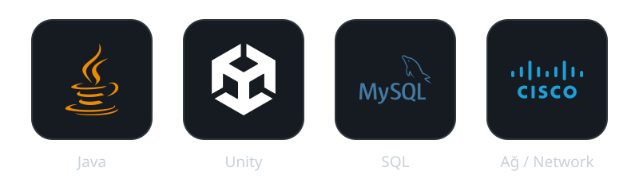

### 🛠️ Teknolojiler

### 📌 Öne çıkan projeler

  
&nbsp;&nbsp;&nbsp;&nbsp;&nbsp;&nbsp;&nbsp;&nbsp;
&nbsp;&nbsp;&nbsp;&nbsp;&nbsp;&nbsp;&nbsp;&nbsp;
&nbsp;&nbsp;&nbsp;&nbsp;&nbsp;&nbsp;&nbsp;&nbsp;

### 📊 GitHub İstatistikleri

&nbsp;&nbsp;&nbsp;&nbsp;&nbsp;&nbsp;

⭐ Profilime uğradığın için teşekkürler!

